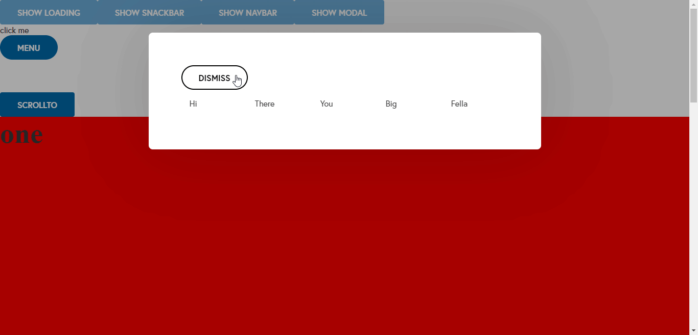

# share

>

[](https://www.npmjs.com/package/share) [](https://standardjs.com)

share is a micro React JS framework with multiple reusable components ... attached with code a react project at example folder to illustrate the use of this frame work to run it simply go to

```bash
> cd /example
> npm start
```



to import and use this frame work at your project run

## Install

```bash
npm install --save share
```

## Usage

```jsx
import React, { Component } from "react";

import share from "share";

class Example extends Component {
  render() {
    return <share.MyComponent />;
  }
}
```

